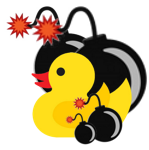
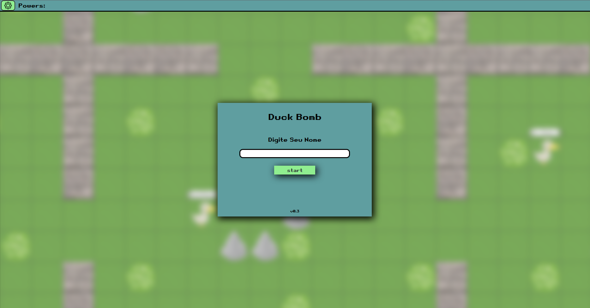
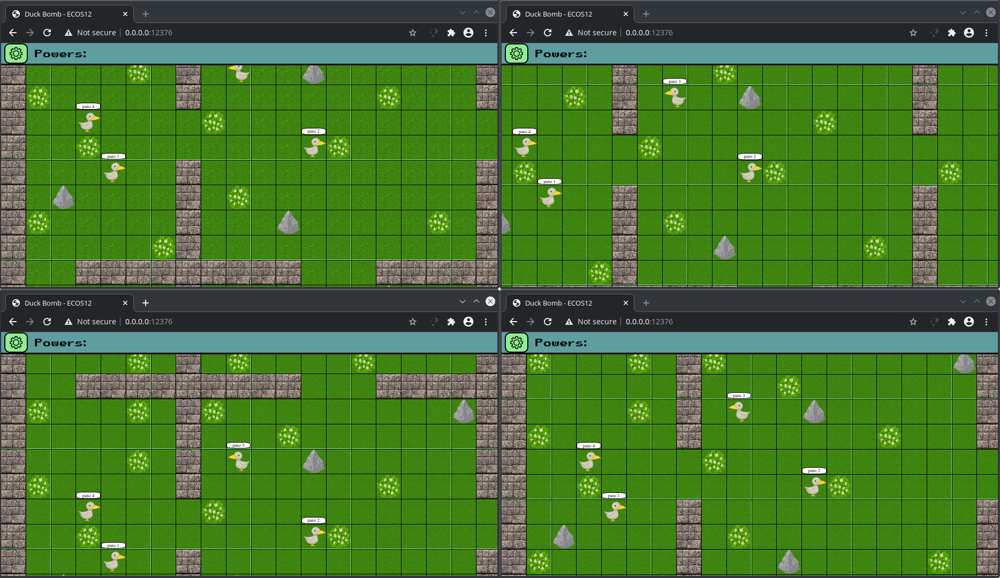

<h1 align="center">
  Duck Bomb
</h1>

Trabalho feito para a disciplina de Laboratório de Sistemas Distribuidos da Universidade Federal de Itajubá.

Esse projeto se trata de um jogo no estilo dos jogos do Bomberman com a temática de pato. Como se trata de uma disciplina de sistemas distribuidos, o jogo é online e feito com a arquitetura de cliente-servidor orientada a objetos.

## Rodar o servidor
### Dependências
- python3 e pip3: `https://www.python.org/`
- eventlet: `$pip3 install eventlet`
- socket.io: `$pip3 install python-socketio`

### Abrindo o servidor
- navegue até a pasta do arquivo principal do servidor:
`$cd ./servidor/componentes`
- abra o arquivo do servidor via python: `$python3 servidor.py`

### Abrindo o cliente
- O ip do servidor é 0.0.0.0, ou seja, qualquer endereço ipv4 do computador. A porta do servidor é 12376.
- Para usar o ip local, basta abrir o link: `http://127.0.0.1:12376/`.

## Screenshots

# Participantes

Alex Junior Pereira

Leonardo Cherobim Dutra

Leonardo Henrique de Melo 

Rodrigo Sodré Coelho